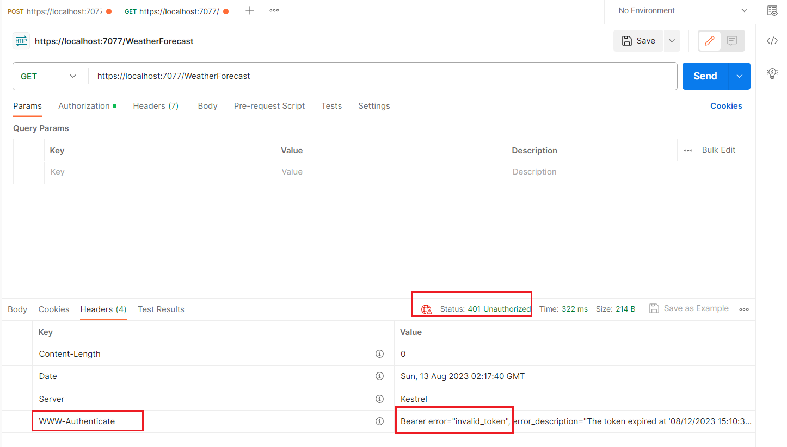
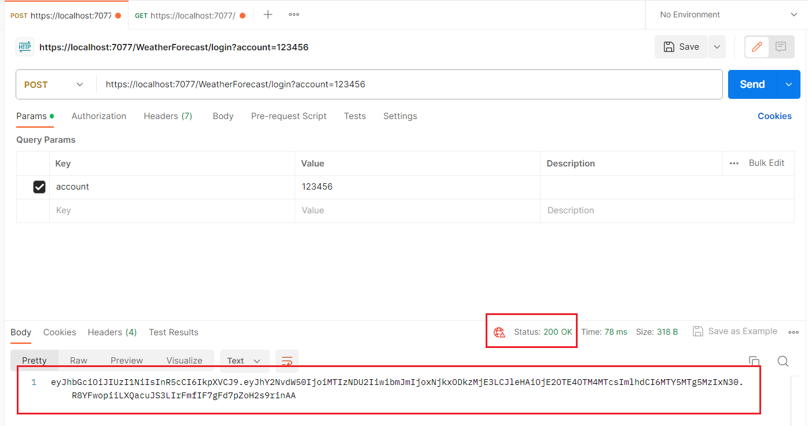
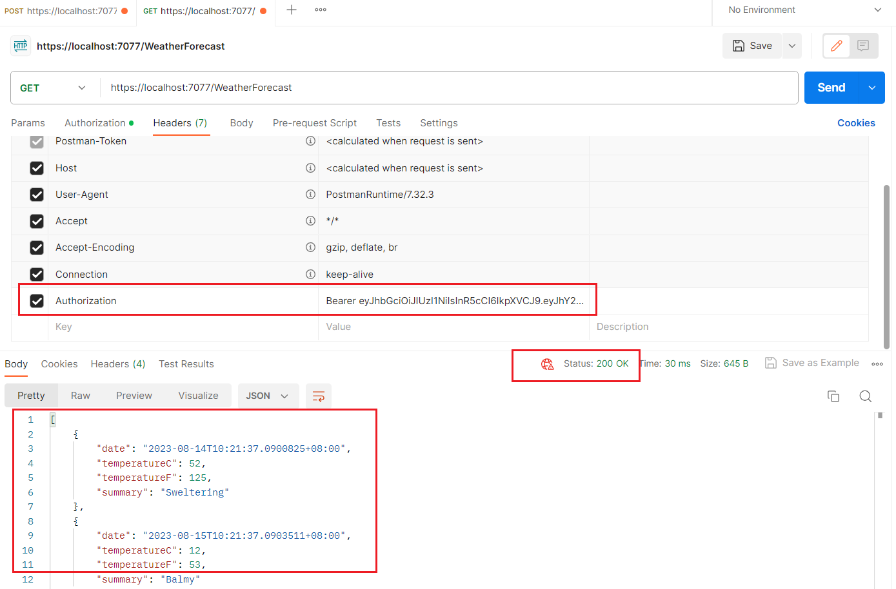

# Webapi配置JWT身份认证案例

## 1. 项目说明

- 目标：演示在项目中进行JWT身份认证配置操作
- Webapi 项目：案例中的项目是VS通过webapi模板创建的最小webapi项目
- .Net 版本：.Net 6.0
- Nuget包：配置JWT用到的包为 `Microsoft.AspNetCore.Authentication.JwtBearer`
- 测试：使用Postman，可以在请求头中添加Token验证请求是否成功

## 2. Demo

>基本流程
>
>1. 准备项目，添加Nuget包
>2. 创建API接口
>3. 配置身份验证
>4. 定义Token生成方法
>5. 编写认证接口
>6. 请求测试

### 2.1 准备项目
在VS中创建最小Webapi，然后添加 Nuget 包：`Microsoft.AspNetCore.Authentication.JwtBearer`

### 2.2 创建API接口

在Controller中定义项目需要的接口，比如下面定义了两个接口：

```csharp
// 数据访问接口
[HttpGet(Name = "GetWeatherForecast")]
public IEnumerable<WeatherForecast> Get()
{
	return Enumerable.Range(1, 5).Select(index => new WeatherForecast
	{
		Date = DateTime.Now.AddDays(index),
		TemperatureC = Random.Shared.Next(-20, 55),
		Summary = Summaries[Random.Shared.Next(Summaries.Length)]
	})
	.ToArray();
}

// 登录接口
[HttpPost("login")]
public IActionResult Login(string account)
{
	return Ok(token);
}
```

在没有启用身份验证之前，所有的接口都能被调用被返回结果。
### 2.3 配置身份验证
在项目的 `Program.cs` 文件中配置身份验证并启用：

```csharp title="nihao"
public class Program
    {
        public static void Main(string[] args)
        {
            var builder = WebApplication.CreateBuilder(args);
            
            // 配置身份验证
            builder.Services.AddAuthentication(options =>
            {
                options.DefaultAuthenticateScheme = 
	                JwtBearerDefaults.AuthenticationScheme;
                options.DefaultChallengeScheme = 
	                JwtBearerDefaults.AuthenticationScheme;
            }).AddJwtBearer(options =>
            {
                // 设置 JWT Bearer 选项
                options.TokenValidationParameters = new TokenValidationParameters
                {
                    
                    // 验证签名秘钥，使用签名秘钥加密时应设为true
                    ValidateIssuerSigningKey = true,
                    // 获取签名秘钥
                    // 如果将普通字符串转换为字节数组，则应使用 Encoding.ASCII.GetBytes("secretKey")
                    // 如果将Base64编码字符串转换为字节数组，则应使用 Convert.FromBase64String(secretKey)
                    IssuerSigningKey = new SymmetricSecurityKey(
	                    Convert.FromBase64String("your_secret_key")
                    ),
                    // 验证存活时间，设置token存活时间时应设为true
                    ValidateLifetime = true,
                    // 验证发行者，payload中不设置issuer时应设为false
                    ValidateIssuer = false,
                    // 验证受众，payload中不设置audience时应设为false
                    ValidateAudience = false,
                    // 时钟偏移，用于纠正不同时区之间传输产生的时间偏移
                    ClockSkew = TimeSpan.Zero
                };
            });
            
		    // 启用身份验证
            app.UseAuthentication();
            
	        // 省略其他代码...
        }
    }
```

!!! Note
	代码中的 `your_secret_key` 为签名加密秘钥，可以分为对称密钥和非对称密钥两种类型。密钥的安全性非常重要，请确保密钥的机密性，以防止未授权的访问和篡改。<br><br>
	**一般建议将签名加密秘钥存储在安全的地方**，例如 *配置文件*，*环境变量* 或 *密钥管理系统* 中。<br><br> 
	**不建议直接在代码中硬编码密钥**，以防止意外泄露。请根据具体安全需求和最佳实践来选择和管理签名加密秘钥。
### 2.4 定义生成Token方法

包中不提供生成Token的方法，需要自己定义，以实现自定义传输数据。下面给出一个生成 Token 的方法：

```csharp title="JwtHelper.cs"
public class JwtHelper
    {
        public string GenerateJwtToken(string account)
        {
            var tokenHandler = new JwtSecurityTokenHandler();
            
            // Header
            JwtHeader header = new JwtHeader
            {
                {JwtHeaderParameterNames.Typ,"JWT"},
                {JwtHeaderParameterNames.Alg, SecurityAlgorithms.HmacSha256 }
            };
            // Payload
            var payload = new[]
            {
                new Claim("account", account),
            };
            // Signature（进行sha256加密）
            var key = Convert.FromBase64String("your_secret_key"); // 获取签名加密秘钥
            var signingCredentials = new SigningCredentials(
	            new SymmetricSecurityKey(key), SecurityAlgorithms.HmacSha256
	        );
	        
            // tonken info
            var exTime = "10";
            var tokenDescriptor = new SecurityTokenDescriptor
            {
                AdditionalHeaderClaims = header,
                Subject = new ClaimsIdentity(payload),
                SigningCredentials = signingCredentials,
                // 设置过期时间
                Expires = DateTime.UtcNow.AddMinutes(double.Parse(exTime)) 
            };
            
            var token = tokenHandler.CreateToken(tokenDescriptor);
            Console.WriteLine(token);
            return tokenHandler.WriteToken(token);
        }
    }
```

在接口中可以使用该方法生成token并发送给客户端，对于常规系统来说，通常是在登录接口中生成并发送。

上述代码中使用了对称加密（`new SymmetricSecurityKey(key)`），请确保生成 token 时的加密方式与配置服务时的方式一致。

### 2.5 编写认证接口

我们为 `login` 接口定义认证，在其中实现 token 生成和发送。并为 `Get()` 接口添加 `[Authorize]` 特性，保证只有通过认证后才能被访问。

```csharp title="controller.cs"
[Authorize]
[HttpGet(Name = "GetWeatherForecast")]
public IEnumerable<WeatherForecast> Get()
{
	// 省略
}

[HttpPost("login")]
public IActionResult Login(string account)
{
	// 省略接口逻辑
	
	// 生成token
	JwtHelper jwtHelper = new JwtHelper();
	string token = jwtHelper.GenerateJwtToken(account);
	
	// 发送token
	return Ok(token);
}
```

### 2.6 请求测试
#### 未认证请求Get

>在 Postman 中调用Get接口，此次请求不携带 token，期望的结果应当是请求失败。

响应结果显示 `401 Unauthorized` 未经许可。响应头中提示token无效。

接下来，请求 Login 接口，来获取 token 值。

<figure markdown> 
    { width="750" }
    <figcaption>不携带Token进行请求</figcaption>
</figure>
#### 请求Login

>在 Postman 中，请求 Login 接口，因为没有标注  `[Authorize]`，所以该接口可以响应未认证的请求，并发送一个 token。

响应结果显示 `200 OK` 表示请求成功，并在body中发送了 token。

接下来，携带该token进行上一步的验证。

<figure markdown> 
    { width="750" }
    <figcaption>请求Login获取Token</figcaption>
</figure>

#### 认证请求Get

>在 Postman 中，携带token再次请求Get() 。将token写入请求头的 `Authorization` 中。注意：在value中除了我们的token外，还有一个 `Bearer ` 前缀。

响应结果显示 `200 OK` 表示请求成功，并在body中返回了请求的数据。

综上，表明我们的JWT身份认证配置完成。

<figure markdown> 
    { width="750" }
    <figcaption>携带Token进行请求</figcaption>
</figure>

## 3. 总结

### 3.1 步骤总结
1. webapi 中配置JWT，可以通过 `Microsoft.AspNetCore.Authentication.JwtBearer` 包实现，在启动文件中配置认证服务并启动。
2. 需要自定义生成Token等方法，以便在接口被调用时生成要发送的token。
4. 为需要认证才能被访问的接口添加  `[Authorize]` 特性，未经认证，请求将被拒绝。
5. 在客户端请求时，请求头的 `Authorization` 的值需要在token前添加 `Bearer ` 前缀，否则将验证失败。
### 3.2 扩展
1. `[Authorize]` 特性不只能添加在方法上，还可以添加到Controller类上，这样整个类的接口都需要认证才能被访问。
2. 除了自定义生成Token的方法，验证Token的方法也可以自定义，需要搭配 `[Authorize]` 的策略实现调用自定义验证方法。
3. 除了使用 `[Authorize]` 还可以定义 Filter 已实现更灵活的功能。

关于扩展内容，本篇不再展开。
